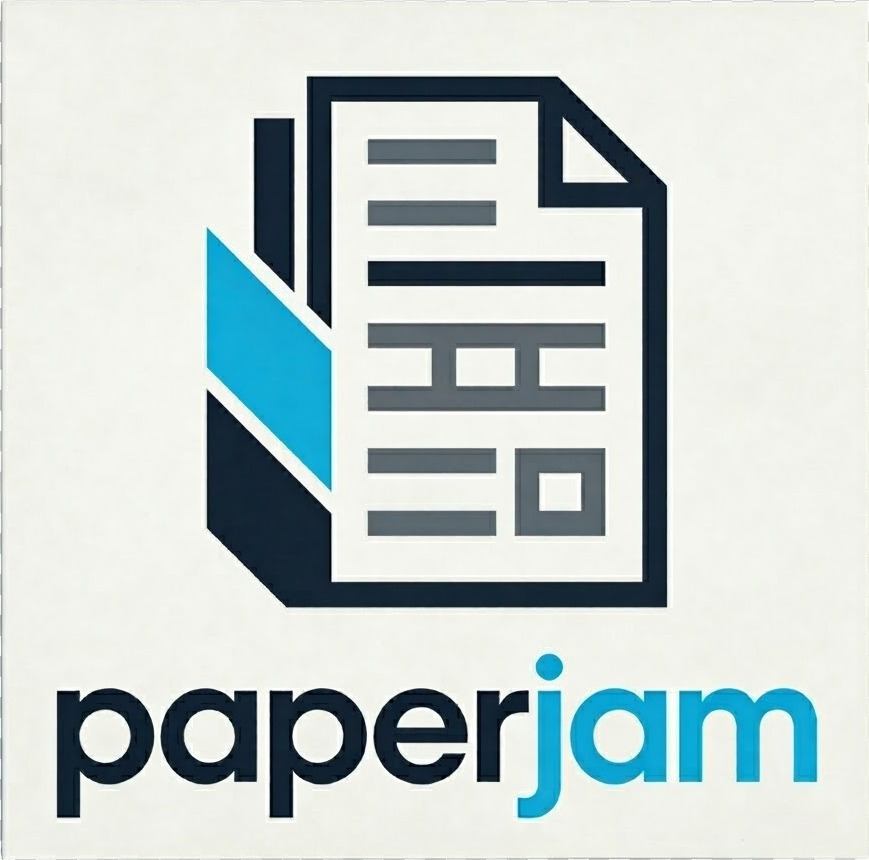

<p align="center">
  
</p>

<p align="center">
  <a href="https://pypi.org/project/paperjam/"></a>
  <a href="LICENSE"></a>
  <a href="https://www.python.org/downloads/"></a>
</p>

Fast document processing powered by Rust. One API. Every document format.

## Supported Formats

| Format | Read | Write | Extract Text | Extract Tables | Convert |
|--------|------|-------|--------------|----------------|---------|
| PDF    | Yes  | Yes   | Yes          | Yes            | Yes     |
| DOCX   | Yes  | Yes   | Yes          | Yes            | Yes     |
| XLSX   | Yes  | Yes   | Yes          | Yes            | Yes     |
| PPTX   | Yes  | Yes   | Yes          | Yes            | Yes     |
| HTML   | Yes  | Yes   | Yes          | Yes            | Yes     |
| EPUB   | Yes  | Yes   | Yes          | -              | Yes     |

## Installation

```bash
pip install paperjam
```

CLI tool (Rust):

```bash
cargo install paperjam-cli
```

## Quick Start

### Open any format

```python
import paperjam

doc = paperjam.open("report.pdf")
docx = paperjam.open("document.docx")
xlsx = paperjam.open("data.xlsx")
pptx = paperjam.open("slides.pptx")
```

### Extract text and tables

```python
doc = paperjam.open("report.pdf")

text = doc.pages[0].extract_text()
tables = doc.pages[0].extract_tables()
md = doc.to_markdown(layout_aware=True)
```

### Convert between formats

```python
paperjam.convert("report.pdf", "report.docx")
paperjam.convert("data.xlsx", "data.pdf")
paperjam.convert("page.html", "page.epub")
```

### Run a pipeline

```yaml
# pipeline.yaml
steps:
  - open: "reports/*.pdf"
  - extract_tables:
      strategy: auto
      output: tables.csv
  - convert:
      format: docx
      output: "converted/"
```

```bash
pj pipeline run pipeline.yaml
```

### CLI usage

The CLI binary installed by `cargo install paperjam-cli` is named `pj`:

```bash
pj info document.pdf
pj extract text report.pdf
pj extract tables data.pdf --strategy lattice --format json
pj convert auto report.pdf -o report.docx
```

### MCP server

```bash
pip install paperjam-mcp
```

Add to your MCP client configuration (Claude Code, Claude Desktop, Cursor):

```json
{
  "mcpServers": {
    "paperjam": {
      "command": "uvx",
      "args": ["paperjam-mcp", "--working-dir", "."]
    }
  }
}
```

## Features

- **Multi-format support** -- PDF, DOCX, XLSX, PPTX, HTML, EPUB through one unified API
- **Text extraction** -- plain text, positioned lines, spans with font info
- **Table extraction** -- lattice and stream strategies with CSV/DataFrame export
- **Format conversion** -- convert between any supported formats
- **Pipeline engine** -- define multi-step document workflows in YAML
- **MCP server** -- expose document operations as tools for AI agents
- **PDF manipulation** -- split, merge, reorder, rotate, delete, insert blank pages
- **Metadata & bookmarks** -- read and edit document properties and outline
- **Annotations & watermarks** -- add, read, remove annotations; text watermarks
- **Forms** -- inspect, fill, create, and modify form fields
- **Security** -- encryption (AES-128/256, RC4), sanitization, true content-stream redaction
- **Digital signatures** -- sign, verify, and inspect with LTV timestamp support
- **PDF/A & PDF/UA** -- validation and conversion, accessibility checks
- **Native async** -- powered by Rust and tokio, no Python thread pools
- **CLI tool** -- full-featured command-line interface for scripting and automation
- **WASM playground** -- try it in the browser at [docs.byteveda.org/paperjam](https://docs.byteveda.org/paperjam/)

## Documentation

Full docs, API reference, and interactive playground at **[docs.byteveda.org/paperjam](https://docs.byteveda.org/paperjam/)**.

## License

MIT
