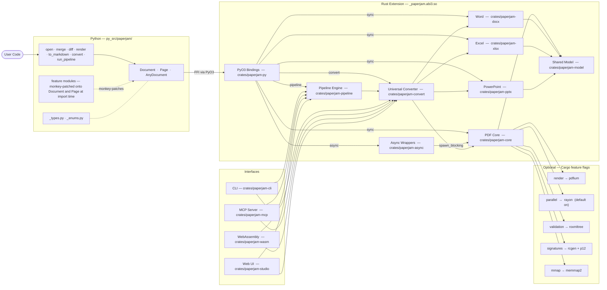
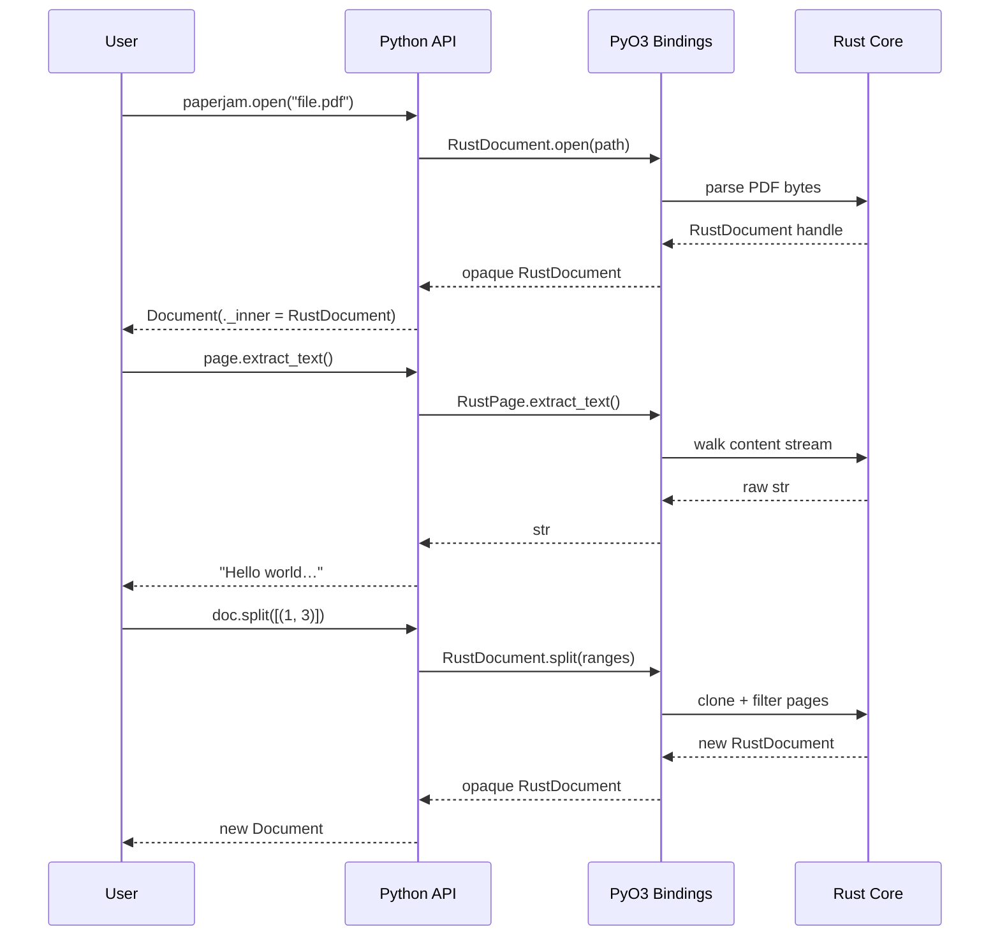

# Architecture

paperjam is a mixed Rust/Python library. Python provides the public API and ergonomics; Rust provides the PDF engine, performance, and safety.

```
paperjam-model (shared types, traits)
    ↑
    ├── paperjam-core (PDF)
    ├── paperjam-docx (Word)
    ├── paperjam-xlsx (Excel)
    ├── paperjam-pptx (PowerPoint)
    ├── paperjam-html (HTML)
    └── paperjam-epub (EPUB)
         ↑
    paperjam-convert (universal converter)
         ↑
    paperjam-pipeline (workflow engine)
         ↑
    ├── paperjam-cli (command line)
    ├── paperjam-mcp (AI agents via MCP)
    ├── paperjam-py (Python bindings)
    ├── paperjam-wasm (WebAssembly)
    ├── paperjam-async (async wrappers)
    └── paperjam-studio (web UI)
```



## Layers

**Python layer** — The public API. `Document` and `Page` are pure-Python classes for PDFs. `AnyDocument` is the format-agnostic wrapper returned by `open()` for non-PDF formats. Feature modules (`_extraction.py`, `_manipulation.py`, etc.) attach methods onto those classes at import time via simple assignment (`Document.method = _method`), keeping each feature self-contained without subclassing.

**PyO3 boundary** — The compiled extension (`_paperjam.abi3.so`) exposes `RustDocument` and `RustPage` as opaque Python objects. All document heavy lifting crosses this boundary via PyO3 FFI. The GIL is released for long-running operations.

**Shared model** — `crates/paperjam-model` defines the common traits and types shared across all format crates: `DocumentLike`, `PageLike`, `ContentBlock`, `Table`, etc. Each format crate implements these traits.

**Format crates** — Each document format has its own crate: `paperjam-core` (PDF), `paperjam-docx` (Word), `paperjam-xlsx` (Excel), `paperjam-pptx` (PowerPoint). They all implement the shared model traits, providing a uniform API regardless of format.

**Universal converter** — `crates/paperjam-convert` bridges between formats. It uses the format crates to read one format and write another, supporting conversions like DOCX to PDF, XLSX to HTML, etc.

**Pipeline engine** — `crates/paperjam-pipeline` provides a YAML/JSON-driven workflow system for batch processing. It orchestrates multi-step operations across files with parallel execution support.

**Async layer** — `crates/paperjam-async` wraps core operations with `tokio::task::spawn_blocking`. The PyO3 bindings expose these as native Python coroutines via `pyo3-async-runtimes::tokio::future_into_py()`. The Python `_async.py` module is a thin shim that imports the Rust async functions and attaches them to `Document` and `Page`.

**CLI** — `crates/paperjam-cli` provides the `pj` command-line tool for document operations: info, extract, convert, pipeline, and more.

**MCP server** — `crates/paperjam-mcp` exposes paperjam capabilities as an MCP server, allowing AI assistants like Claude Code and Cursor to process documents directly.

**Feature flags** — Optional capabilities gated behind Cargo features. `parallel` (rayon) is on by default. `render`, `signatures`, `validation`, and `mmap` must be enabled at compile time.

## Data flow


