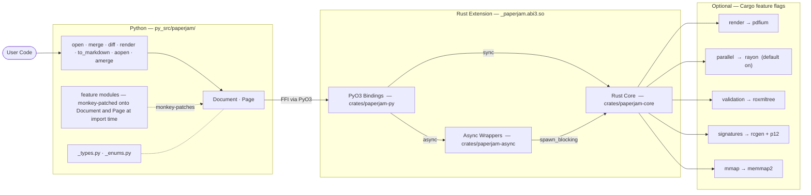
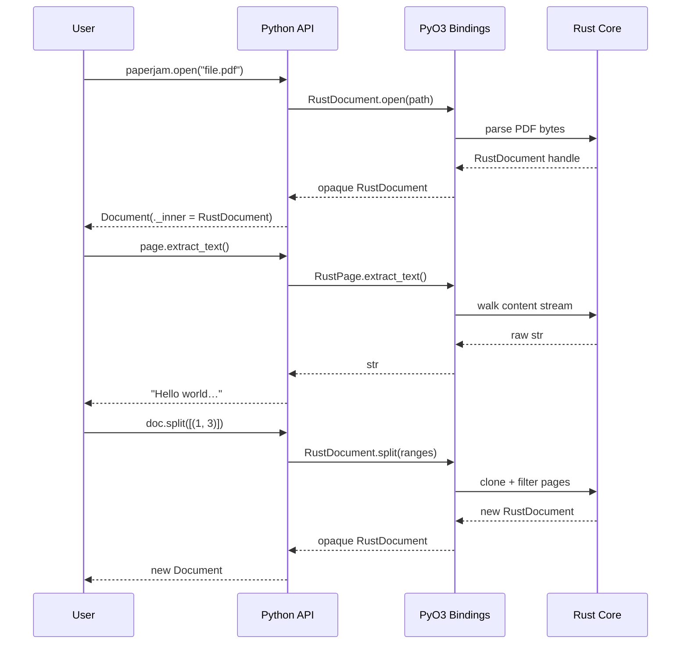

# Architecture

paperjam is a mixed Rust/Python library. Python provides the public API and ergonomics; Rust provides the PDF engine, performance, and safety.

## Layers

**Python layer** — The public API. `Document` and `Page` are pure-Python classes. Feature modules (`_extraction.py`, `_manipulation.py`, etc.) attach methods onto those classes at import time via simple assignment (`Document.method = _method`), keeping each feature self-contained without subclassing.

**PyO3 boundary** — The compiled extension (`_paperjam.abi3.so`) exposes `RustDocument` and `RustPage` as opaque Python objects. All PDF heavy lifting crosses this boundary via PyO3 FFI. The GIL is released for long-running operations.

**Rust core** — `crates/paperjam-core` owns the PDF object model, parser, text engine, table extractor, manipulation primitives, security operations, and diff algorithm. No Python dependencies; usable as a standalone Rust crate.

**Async layer** — `crates/paperjam-async` wraps `paperjam-core` operations with `tokio::task::spawn_blocking`. The PyO3 bindings expose these as native Python coroutines via `pyo3-async-runtimes::tokio::future_into_py()`. The Python `_async.py` module is a thin shim that imports the Rust async functions and attaches them to `Document` and `Page`.

**Feature flags** — Optional capabilities gated behind Cargo features. `parallel` (rayon) is on by default. `render`, `signatures`, `validation`, and `mmap` must be enabled at compile time.

## Data flow

